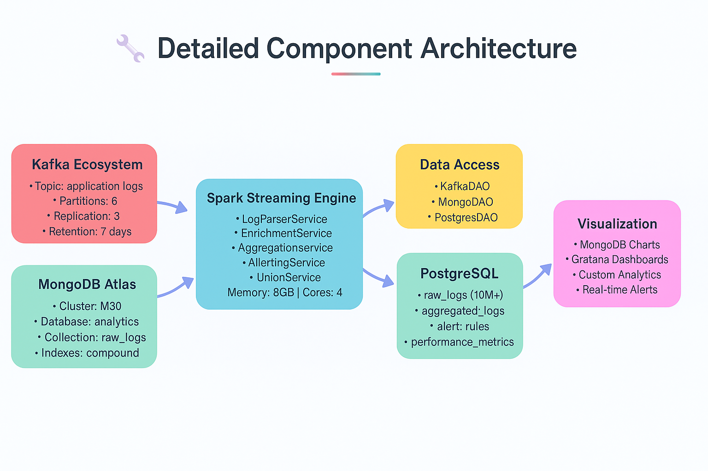
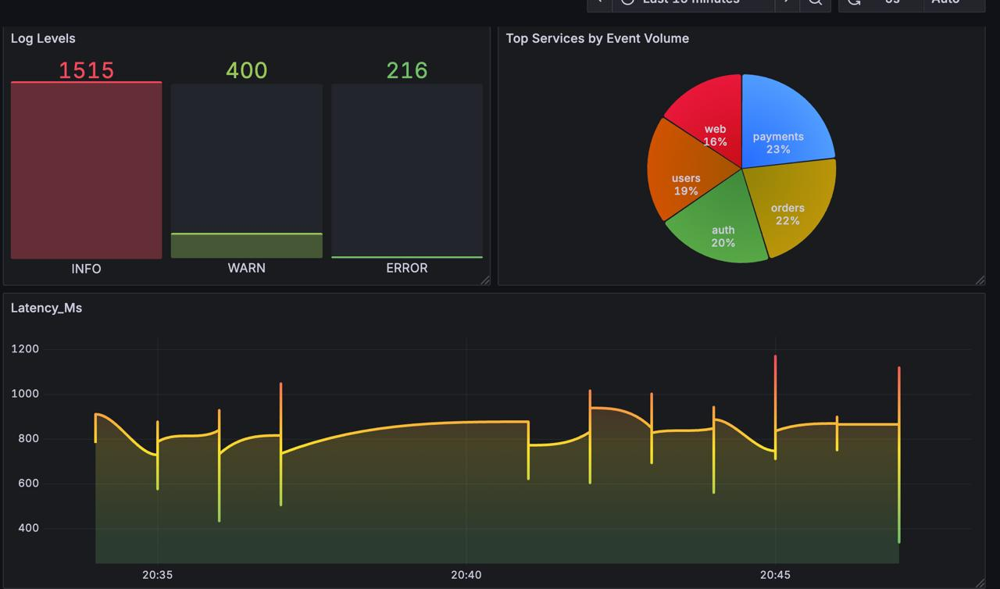
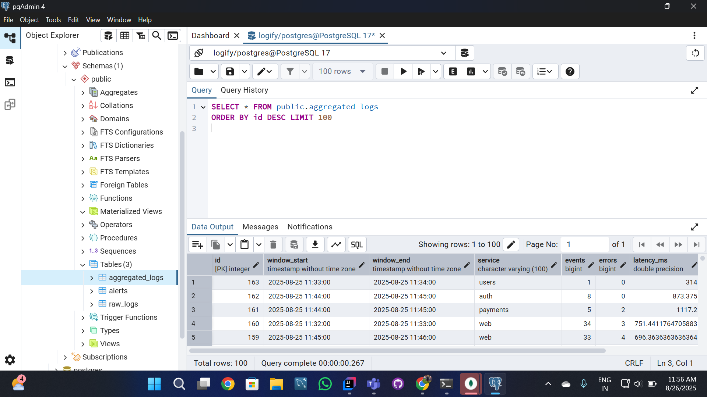
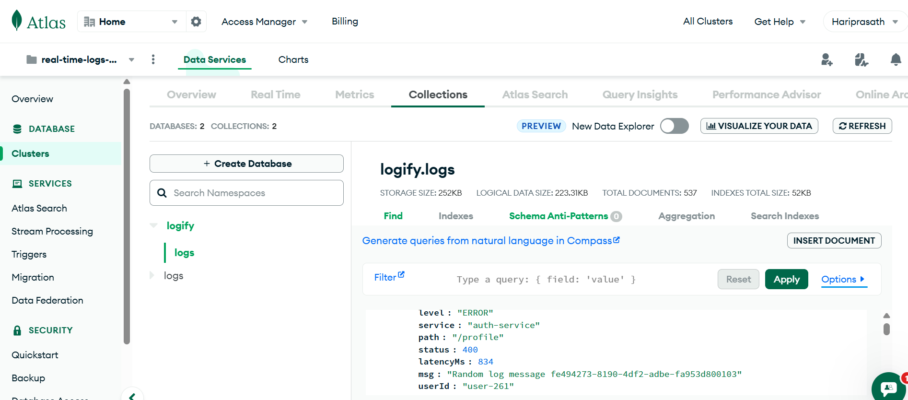
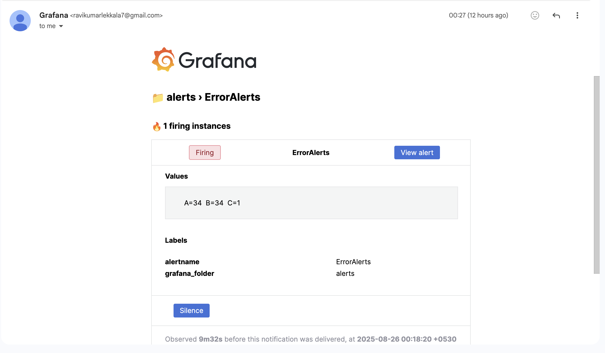

# 📊 Real-Time Log Analytics System

## 🚀 Overview

The **Real-Time Log Analytics System** is a scalable platform for **real-time log ingestion, processing and analytics**.  
It seamlessly integrates **streaming data from Kafka** and **historical data from MongoDB**, processes it using **Apache Spark Structured Streaming**, and persists enriched insights into **PostgreSQL** for analytics, dashboards, and alerting.

### ✨ Key Capabilities
- ⏱️ **Real-time monitoring** of distributed application logs  
- 🚨 **Error detection & alerting** with configurable thresholds  
- ⚡ **Performance insights**: request latency, throughput, error rates  
- 📊 **Interactive dashboards** with **Grafana / Superset / Atlas Charts**  
- 🔄 **Hybrid pipeline**: combine real-time (Kafka) + historical (MongoDB)  

---

## 🏗️ System Architecture

```text
Kafka (Streaming Logs) ----\
                            >---- Spark Structured Streaming ----> PostgreSQL (Analytics DB) ----> Grafana ----> Alerts
MongoDB (Historical Logs) --/                      
````



---

## 📂 Project Structure

```text
src/main/scala/com/loganalytics/
  ├── controller/
  │    ├── KafkaStreamController.scala   # Kafka streaming pipeline
  │    ├── MongoBatchController.scala    # Mongo batch pipeline
  │    └── LogStreamController.scala     # Orchestrates both pipelines
  ├── dao/
  │    ├── KafkaDAO.scala                # Kafka ingestion
  │    ├── MongoDAO.scala                # Mongo ingestion
  │    └── PostgresDAO.scala             # PostgreSQL persistence
  ├── service/
  │    ├── LogParserService.scala        # Parse JSON logs → structured DF
  │    ├── RawLogService.scala           # Normalize raw schema
  │    ├── MongoLogService.scala         # Transform MongoDB logs
  │    ├── AlertingService.scala         # Detect error/latency alerts
  │    └── AggregationService.scala      # Windowed aggregations
  └── utils/
       └── SchemaUtils.scala             # Centralized schema definitions
```

---

## ⚙️ Tech Stack

| Technology                                                                                      | Role                         |
| ----------------------------------------------------------------------------------------------- | ---------------------------- |
|  | Real-time log ingestion      |
|            | Historical logs + metadata   |
|   | ETL, enrichment & analytics  |
|   | Analytics-ready data sink    |
|                  | Data pipeline implementation |
|               | Containerized deployment     |
|            | Visualization & alerting     |

---

## 📥 Setup & Installation

### 1️⃣ Clone Repository

```bash
git clone https://github.com/your-username/real-time-log-analytics-system.git
cd real-time-log-analytics-system
```

### 2️⃣ Configure Connections

Update credentials in:

```
src/main/resources/application.conf
```

### 3️⃣ Start Dependencies

* ▶️ Start **Kafka broker + Zookeeper**
* 🐘 Start **PostgreSQL** instance
* ☁️ Ensure **MongoDB Atlas** cluster is accessible

### 4️⃣ Build & Run Pipelines

```bash
# Start Zookeeper
bin/zookeeper-server-start.sh config/zookeeper.properties  

# Start Kafka broker
bin/kafka-server-start.sh config/server.properties  

# Start consumer (debugging)
bin/kafka-console-consumer.sh --bootstrap-server localhost:9092 --topic logs --from-beginning
```

### 5️⃣ Run Spark Job

```bash
sbt run
```

---

## 📊 Visualization

### Grafana

* Connect PostgreSQL as a data source
* Import prebuilt **log monitoring dashboards**



### PostgreSQL (PgAdmin)

* Explore normalized log data in **analytics-ready tables**



### MongoDB Atlas

* Query historical logs



---

## 🔎 Example Queries

**Logs per service (hourly aggregation):**

```mongodb
[{
  $group: {
    _id: { service: "$service", hour: { $hour: "$event_time" } },
    count: { $sum: 1 }
  }
}]
```

**Error trend analysis:**

```mongodb
[{
  $match: { level: "ERROR" }
}, {
  $group: {
    _id: { service: "$service", hour: { $hour: "$event_time" } },
    errors: { $sum: 1 }
  }
}]
```

---

## 🖥️ Console Output

When running, you’ll see Spark Structured Streaming processing batches like:

```
[KafkaController] Starting Kafka streaming pipeline…
[JdbcWriter][kafka] Processing RAW batch 12 with 105 records → raw_logs
[JdbcWriter][kafka] ✅ Wrote RAW batch 12 to raw_logs
[JdbcWriter][kafka] Processing AGGREGATES batch 5 with 7 records → aggregated_logs
[JdbcWriter][kafka] ✅ Wrote AGGREGATES batch 5 to aggregated_logs
[JdbcWriter][kafka] Processing ALERTS batch 4 with 2 records → alerts
[JdbcWriter][kafka] ✅ Wrote ALERTS batch 4 to alerts
```

This confirms **data is being ingested, aggregated, and stored** in PostgreSQL.

---

## 🚨 Alerts

Rules can be configured for anomaly detection:

* ❌ **Error rate > 5% in 10 min** → Trigger alert
* 🕑 **Latency > 2s** for critical services → Notify via Slack/Email



---

## 🤝 Contributing

Contributions are welcome!

1. 🍴 Fork the repository
2. 🌱 Create a feature branch (`git checkout -b feature/new-feature`)
3. ✅ Commit changes (`git commit -m 'Add new feature'`)
4. 🚀 Push (`git push origin feature/new-feature`)
5. 🔁 Open a Pull Request

---

## 📜 License

MIT License © 2025
